# 1701QCA Making Interaction - Assessment 2 workbook

You will use this workbook to keep track of your progress through the course and also as a process journal to document the making of your projects. The comments in italics throughout the template give suggestions about what to include. Feel free to delete those instructions when you have completed the sections.

When you have completed the template, submit the link to the GitHub Pages site for this repository as a link in Learning@Griffith. The link should be something like [https://qcainteractivemedia.github.io/1701QCA-Assessment2/](https://qcainteractivemedia.github.io/1701QCA-Assessment2/) where `qcainteractivemedia` is replaced with your GitHub username and `1701QCA-Assessment2` is replaced with whatever you called the repository this template is contained in when you set it up.

## Project working title ##
*Insert a name for the project as you conceive of it at the moment.*
### Mindless, timeful cycle ###

## Related projects ##
*Find about 6 related projects to the project you choose. A project might be related through  function, technology, materials, fabrication, concept, or code. Don't forget to place an image of the related project in the appropriate folder and insert the filename in the appropriate places below. Copy the markdown block of code below for each project you are showing.*

### Related project 1 ###
#### Giant LED sign for $15/foot ####
Project url:[https://blog.arduino.cc/2016/06/29/a-giant-arduino-powered-scrolling-led-sign-costs-15foot/](https://blog.arduino.cc/2016/06/29/a-giant-arduino-powered-scrolling-led-sign-costs-15foot/)

This project is related to mine because its lighting system is very similar to the intended lighting set up that I will use. This project uses eight WS2812/Neopixel LED light strips that are stacked vertically and programmed to display text, my implementation of this sign will use the microbits 5 high LED resolution and will be about a meter long compared to this project which is about 7 meters long.

### Related project 2 ###
*Insert name of project*.   Jenny holzer
#### Jenny holzer####
*Insert URL to project*
[https://blog.arduino.cc/2016/06/29/a-giant-arduino-powered-scrolling-led-sign-costs-15foot/](https://blog.arduino.cc/2016/06/29/a-giant-arduino-powered-scrolling-led-sign-costs-15foot/)

This project is related to mine because *insert reasons here*.
This project is related to mine because it uses the 

### Related project 3 ###
*Insert name of project*
#### Giant LED sign for $15/foot ####
*Insert URL to project*
[https://blog.arduino.cc/2016/06/29/a-giant-arduino-powered-scrolling-led-sign-costs-15foot/](https://blog.arduino.cc/2016/06/29/a-giant-arduino-powered-scrolling-led-sign-costs-15foot/)

This project is related to mine because *insert reasons here*.
This project is related to mine because it uses the 

### Related project 4 ###
*Insert name of project*
Giant LED sign for $15/foot
*Insert URL to project*
[https://blog.arduino.cc/2016/06/29/a-giant-arduino-powered-scrolling-led-sign-costs-15foot/](https://blog.arduino.cc/2016/06/29/a-giant-arduino-powered-scrolling-led-sign-costs-15foot/)

This project is related to mine because *insert reasons here*.
This project is related to mine because it uses the 

### Related project 5 ###
*Insert name of project*
Giant LED sign for $15/foot
*Insert URL to project*
[https://blog.arduino.cc/2016/06/29/a-giant-arduino-powered-scrolling-led-sign-costs-15foot/](https://blog.arduino.cc/2016/06/29/a-giant-arduino-powered-scrolling-led-sign-costs-15foot/)

This project is related to mine because *insert reasons here*.
This project is related to mine because it uses the 

### Related project 6 ###
*Insert name of project*
Giant LED sign for $15/foot
*Insert URL to project*
[https://blog.arduino.cc/2016/06/29/a-giant-arduino-powered-scrolling-led-sign-costs-15foot/](https://blog.arduino.cc/2016/06/29/a-giant-arduino-powered-scrolling-led-sign-costs-15foot/)

This project is related to mine because *insert reasons here*.
This project is related to mine because it uses the 
## Other research ##

### *Brief resource name/description* ###
* [https://projects.jennyholzer.com/LEDs](https://projects.jennyholzer.com/LEDs)
* Jenny Holzer - Inspiration
* [https://www.ntticc.or.jp/en/exhibitions/2011/mikami-seiko-desire-of-codes/](https://www.ntticc.or.jp/en/exhibitions/2011/mikami-seiko-desire-of-codes/)
* Seiko Mikami - Inspiration
* [https://wp.josh.com/2016/05/20/huge-scrolling-arduino-led-sign/](https://wp.josh.com/2016/05/20/huge-scrolling-arduino-led-sign/)
* Josh Levine - Build blog of functional requirements
* [https://core-electronics.com.au/5m-rgb-led-strip-ws2812-60-per-meter-black-strip-weatherproof.html](https://core-electronics.com.au/5m-rgb-led-strip-ws2812-60-per-meter-black-strip-weatherproof.html)
* Core electronics - to source parts and some tutorials 
* [https://www.kitronik.co.uk/blog/distance-sensing-microbit-hc-sr04-module](https://www.kitronik.co.uk/blog/distance-sensing-microbit-hc-sr04-module)
* Micro:bit tutorial for the Ultrasonic distance sensor

## Conceptual progress ##

### Design intent ###
Art installation that communicates ideas about living with technology.

### Design concept 1 ###
My first idea for an interactive that aligns with the design intent, was inspired by Seiko Mikami's *Desire of Codes* this interactive installation has a range of cameras that follow visitors recording them, this footage is projected onto a screen showing past and present visitors in a cool hexagonal visualization. My idea was to use the microbit to create a smart home device reminiscent of Google home/Alexa, the device would listen to people around it and then play back recording of what people have said around it. The device could even have some visual element to get people talking about it while they're nearby. 

One of the big dampeners on this idea is the limitations of the microbit. Its only a simple device with limited processing power and storage and has pretty limited functionality when it comes to audio. Due to the small storage size the melodies that it can play are short, only a few seconds and as fair as I am concerned there is no way to record sounds.
This combined with the intensive processing that would be required to trim audio clips and play them back puts the microbit in out of its depths. 

[Seiko Mikami's Desire of Codes](https://www.ntticc.or.jp/en/exhibitions/2011/mikami-seiko-desire-of-codes/)

### Design concept 2 ###
My second idea was focused around the infinite scroll user interface used by many of the most popular apps today. The human nature of how we are so easily captivated by this UI I find very interesting. From my own personal experience I've found my self captivated by a screen on many an odd occasion yet it is hard to resist; On the bus looking at the persons phone I front of me if I don't have my own, during a conversation even when I'm quite engaged in it, and when some ones instagram feed is in my field of view, all of these examples are just when I'm looking at others screens and not my own. So is it the swiping or the screen? This is an idea that I wanted to explore for the design intent. My idea to implement this would be screen similar to a phone with a similar UI to instagram of facebook however instead of showing a personalized catalog of images they would be random or stock images. The purpose would be to see how and if people would engage with just a random feed. Would people scroll? How long for? Other interesting ideas for this project could be placing it at a free charging station to see if people would use it to substitute their phone.
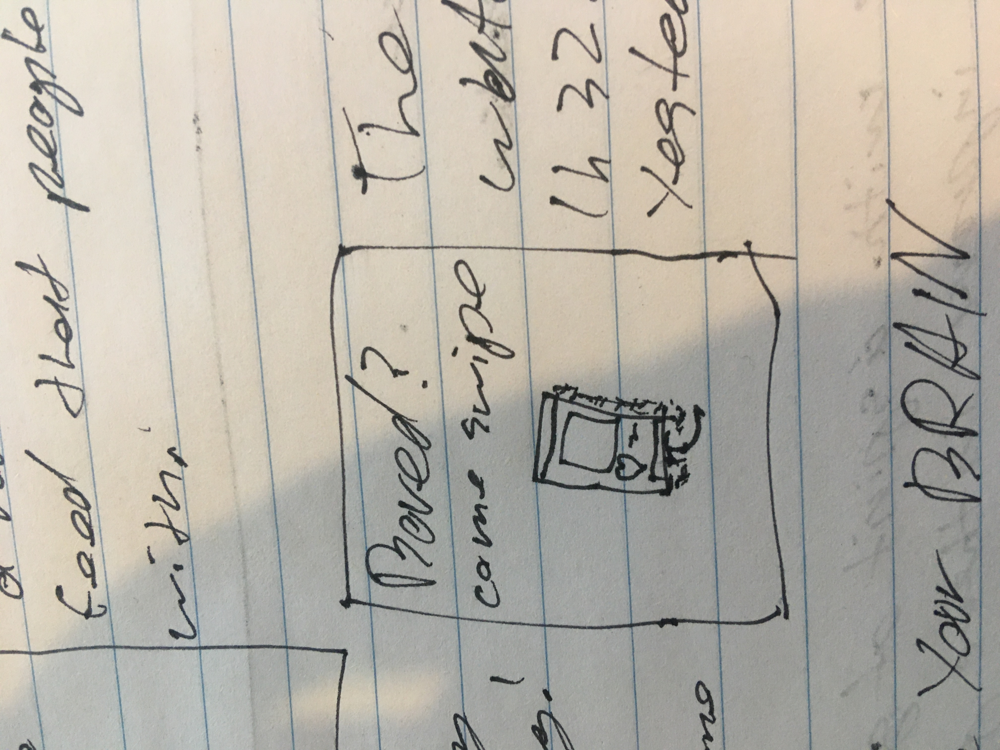
### Final design concept ###
The final design concept is a sculpture that displays text on an LED screen and that text changes as a person approaches and it detected by the sculpture. The LED screen will be the focal point of the sculpture as it will display a range of text strings with different messages; one standard loop and one for when someone is detected to be in front of the sculpture.  The sculpture will be used to provoke interest and attract people to engage in the interaction. 

#### Functionality ####
The technical functionality will vary in complexity the electronic implementation should be quite simple with only a range of LED strips and a sensor to be connected to the micro bit however, the coding side of the project will be quite intensive. 
The following is a wiring diagram 
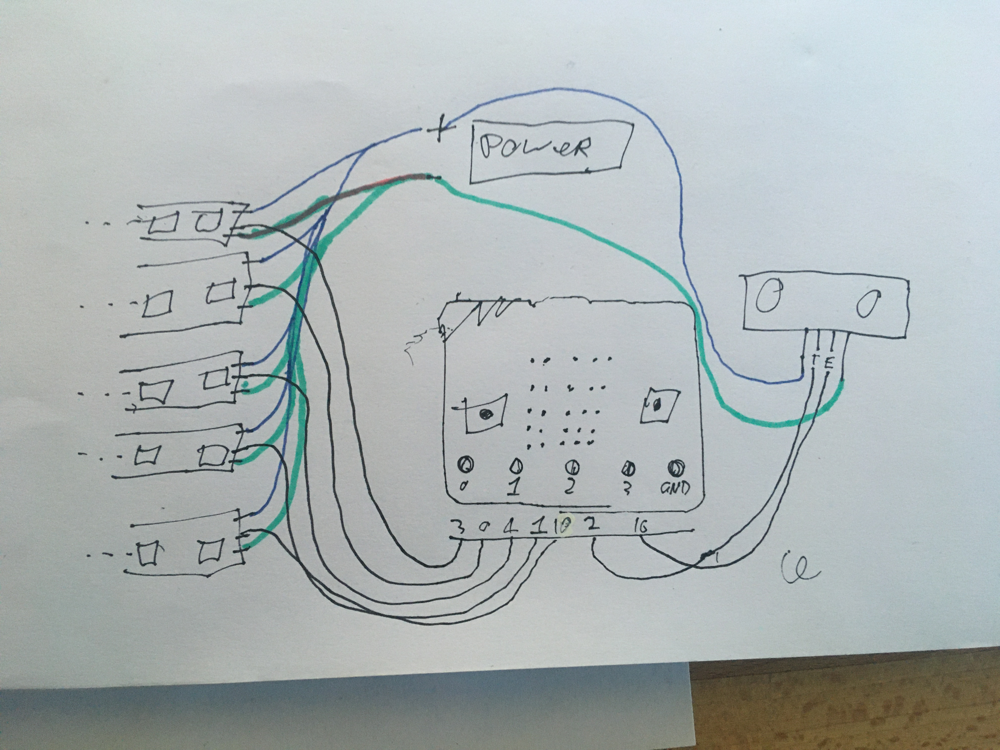
#### Fabrication ####
At the current stage of the project much of the fabrication is still to be worked out. My current thinking is to get a long sheet of flexible plastic and bend it into the figure 8 style shape the led screen can then be glued onto this. In the image further down of the paper prototype hanging up the sculpture is supported by string this will likely be use to hang the final project as well. The electronic componated will 
##### Material list #####
* 5m RGB addressable LED strip WS2812 60LEDs/meter 
* Electrical wire?
* Heat shrink tubing?
* Strip of flexible plastic?
* String
* Wood or other construction material(for hanging frame)

#### Aesthetics ####
The aesthetics of Jenny Holzers LEDS have been very inspirational in the conception of the project. With the first conception seeming quite reminiscent of some of her works. 
 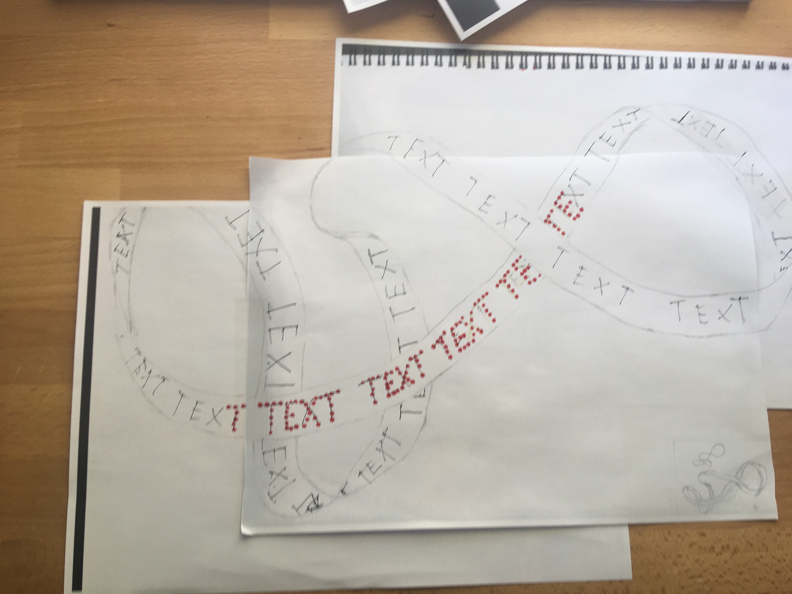
 The image above is a sketch of the original conception. The black text is the original imagining of how the project may look. The red text is the revision of the design having a smaller LED screen in the center of the sculpture.  This decision was made to shorten the LED screen after researching the materials to use. It was quickly discovered after a few measurements of a paper prototype that a lot of LEDs will be needed and that it would be quite expensive to have lights running around the whole sculpture. 
It was calculated that the prototype was 336cm long and I intend on using a 5 high LED resolution like the micro bit so this would need 15 meters of LED strips. After looking on the Neopixel website it was found that even buying the cheapest strips (30LEDS/meter) would cost a whole $300+ and this is not feasible, so cutting the LED screen down to 1 meter means this project can be more affordable with almost the same aesthetic effect.
 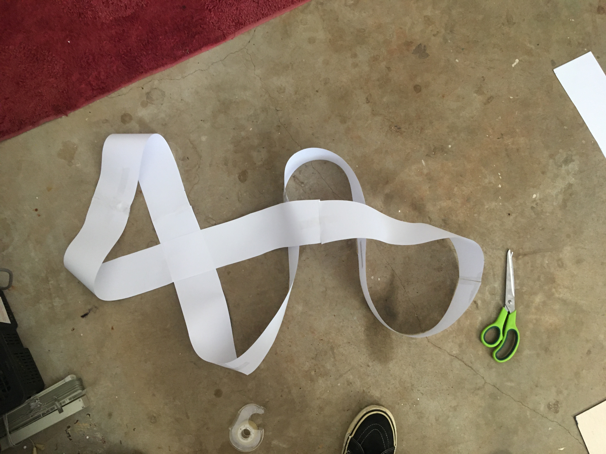
The paper prototype is shown above this was made very simply and was used to estimate the LED cost as well as getting a feel for how the whole thing will look, feel and work.

#### Interaction ####
At the stage of development when I considered interaction I was racking my head to think about how people could engage with this project as it was only text scrolling across the screen. I thought about the different triggers and interfaces that are available, starting with the ones that on board the microbit. However, I did not think of a suitable trigger in the inventors kit I did think of using an ultrasonic distance sensor as it could detect people approaching the artwork to view it. At this point I had the epiphany to combine a LED strip of text with the figure 8 style shape and make it a sculpture. In incorporating the LED screen into the sculpture I believe people will be drawn into the artwork and will approach it for a closer look. This then can trigger the interaction of the text changing state. Testing, iterating and experimenting will be required to find out if the interaction will actually be carried out. Designing a range of signifiers to signal appropriate action may be required. 

### Interaction flowchart ###
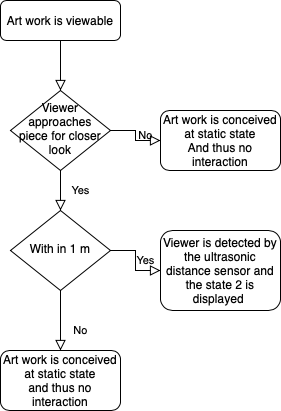
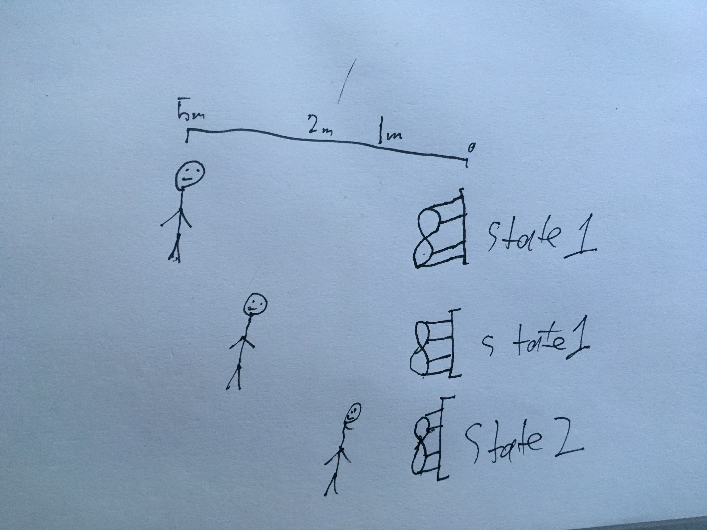
## Physical experimentation documentation ##
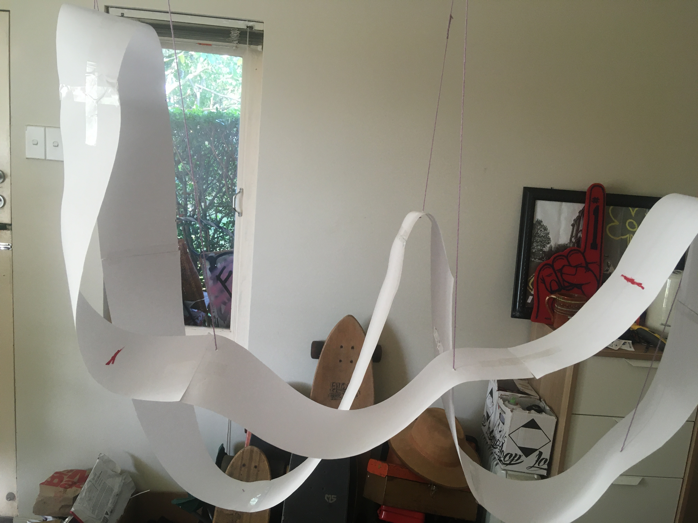
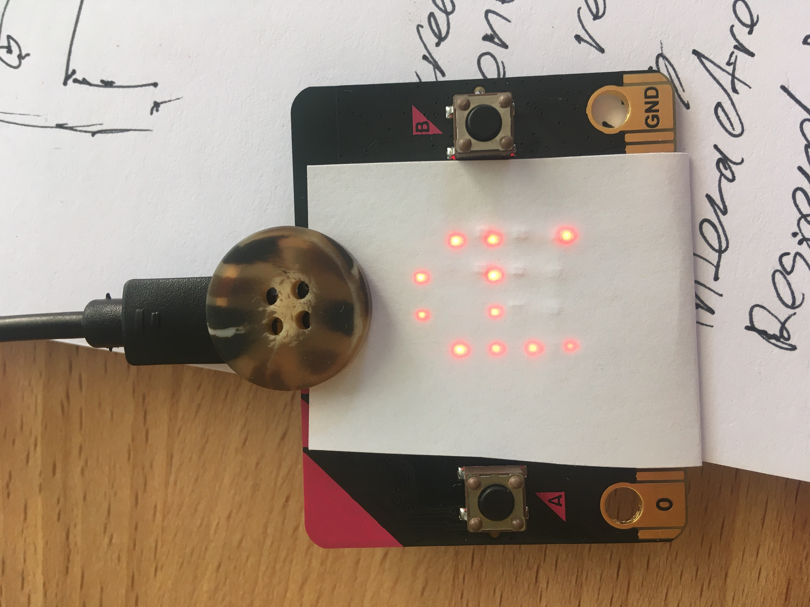
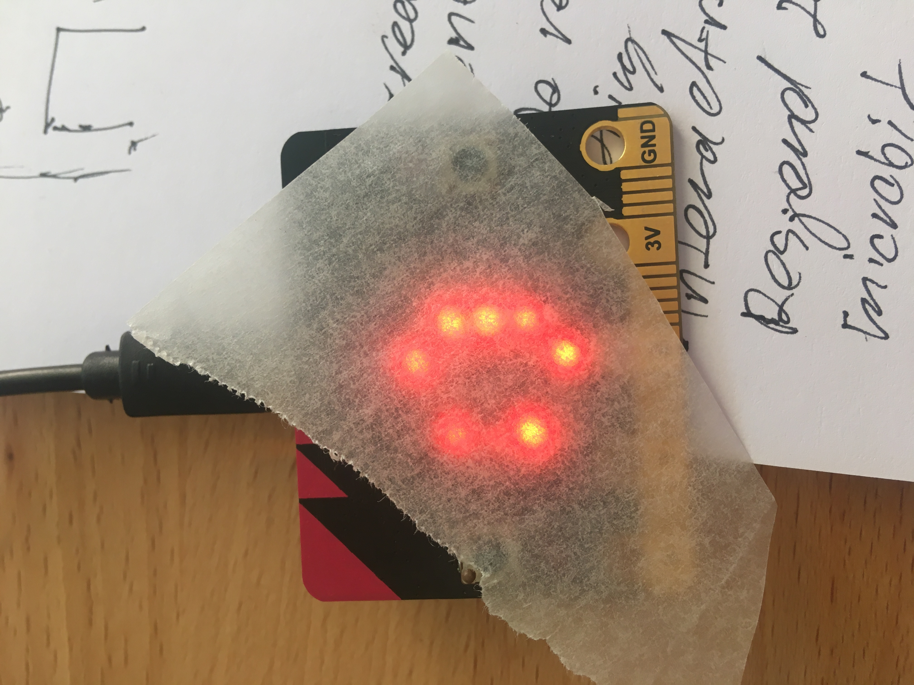
*In this section, show your progress including whichever of the following are appropriate for your project at this point.
a.	Technical development. Could be code screenshots, pictures of electronics and hardware testing, video of tests. 
b.	Fabrication. Physical models, rough prototypes, sketches, diagrams of form, material considerations, mood boards, etc.
Ensure you include comments about the choices you've made along the way.*

*You will probably have a range of images and screenshots. Any test videos should be uploaded to YouTube or other publicly accessible site and a link provided here.*

## Design process discussion ##
*Discuss your process in getting to this point, particularly with reference to aspects of the Double Diamond design methodology or other relevant design process.*
In developing this design there where a range of questions and the process was not always linear. A lot of the most productive time spent of the project was in short burst, when looking at this through the Double diamond these were times of diverging. Moments like in the week 6 class and other times throughout development vast brainstorms were conducted and this is where many of the key ideas for the project have been conceptualized. 
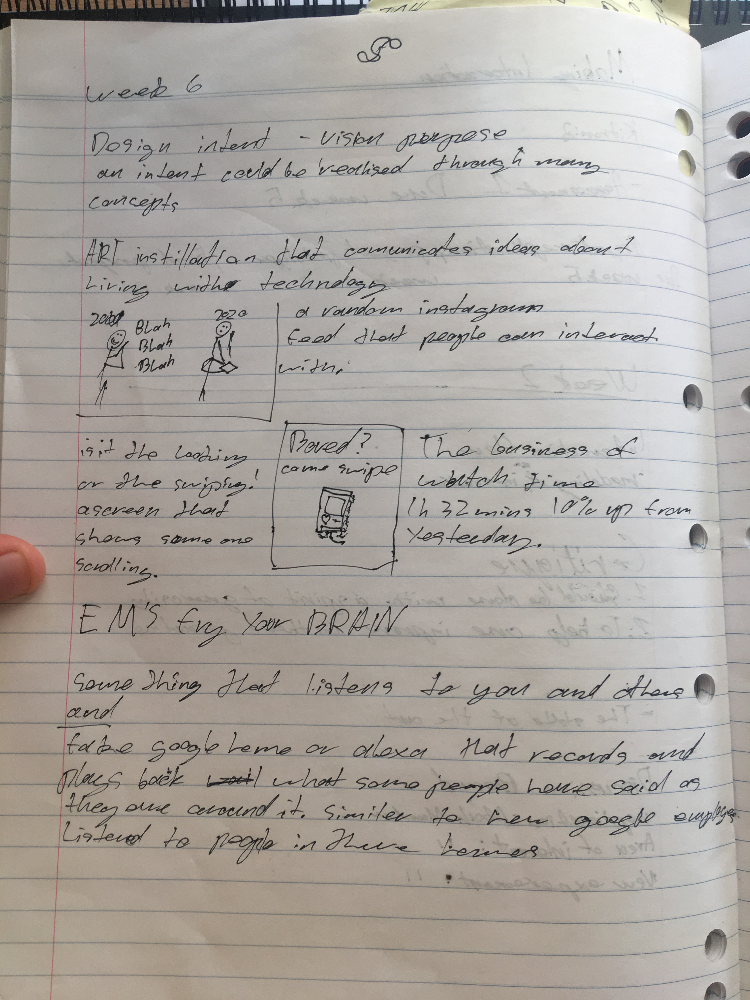
The above image is of a brainstorm conducted in the week 6 class, in this the design intent was formed as with a few possible concepts. Some other key ideas mentioned in this include; watch time, the compulsion to swipe, how interaction with technology has changed, and recording the audience and playing them back. No solid concept was found.
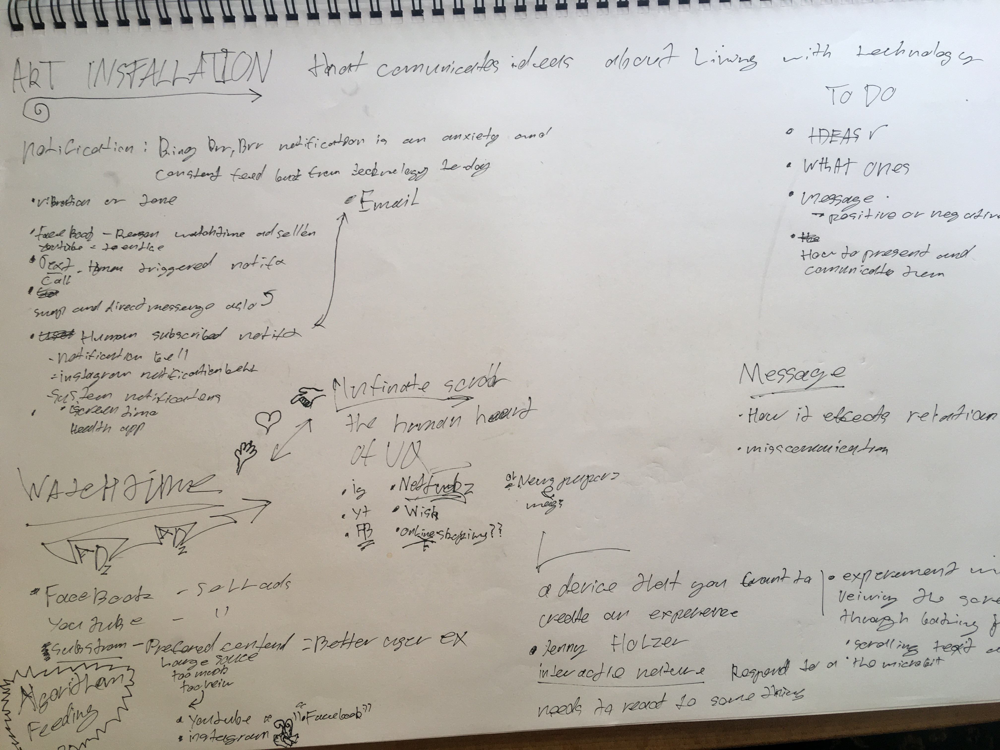
The above brain storm was written on A3 and conducted in week 7. This brainstorm dove into the state of the art in life with technology specifically how technology communicates with us. Some other key ideas mentioned include; notifications (subscribed,human trigged and programmed), watch time and ads, algorithm driven content feeding, infinite scroll, and what the message of the work could be. From this still no final concept was made though it further developed the thinking and intent behind the work. 
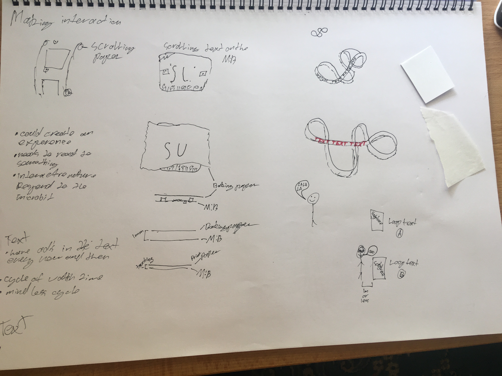
The final image in this section shows a last brainstorm that was conducted between weeks 7 & 8 this explored possible concepts and implementations. In this brainstorm two concepts were sketched with a third coming later, one used the microbit motor to create a paper instagram feed this would have a small size and would imitate using instagram on the phone, another idea this one we discussed in class experimented with using the microbit screen a different ways that it can be viewed or displayed. The third sketch is likely to be the final implementation this was inspired by Jenny Holzer's work as well as one of my own previous works, I combined these aesthetic ideas into the sketch you see here and the others in the final concept section. From this I then focused on developing interaction. 

When reflecting on this and referencing the double diamond I made a range of diverging and converging actions to brainstorm and then pin down effective ideas. In doing this I could solidify my design intent and define the key ideas of the project. It also helped open up to other ideas that I may not have considered otherwise. I also tried to evolve others in the development by asking those that I live with what there thoughts were on the project and some of the ideas were, this feedback was often useful to generate other ideas and consider things I overlooked myself. 
The following image is of my personal work that influenced the design. This was first created as a random thought for a daily creation in the first weeks of 1703QCA, the image here is a painting of it some time later. I have always found it a captivating shape and that is why I intend to use it in the final design

## Next steps ##
1. Lock down needed software for the text to be scrolled across the screen 
2. Experiment and find the appropriate material to make the sculpture out of.
3. Buy needed components 
4. Fabricate project
5. Test interaction  
